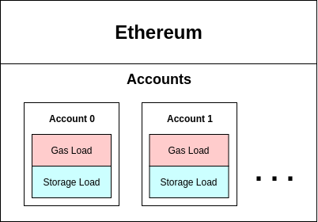
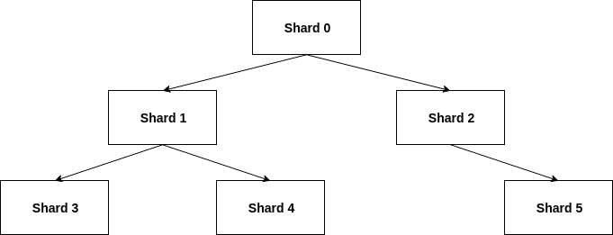
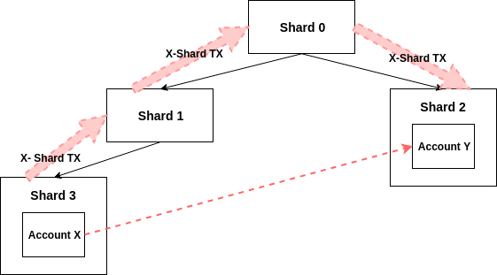
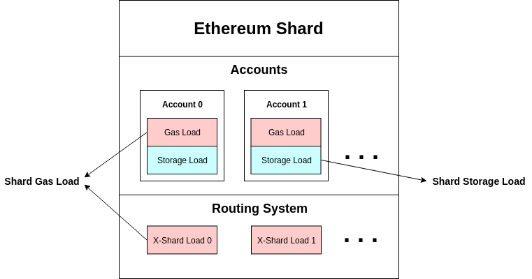
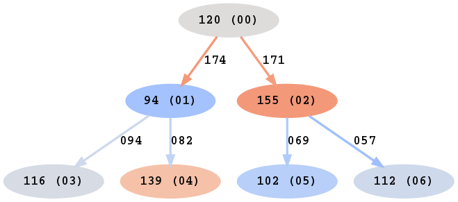

# Load Balancing in CBC Casper Sharding

## Introduction

### Gas & Storage
- It is the duty of the validators to verify all transactions that are occur on the blockchain. These two things are expected of the validators:
  + Validators need to store the state, and the size of this state is called the "**storage size**".
  + They also need to execute the state transitions proposed by blockchain transactions, and the cost of computing these (per unit time) is called "**gas consumption**". We will concern ourselves with the average gas consumption for the purpose of load balancing.
- Currently in Ethereum, gas consumption is limited by specified "**gas limits**" per block. There are no limits for the storage size.

### Sharding
- There is a requirement on minimum validator hardware:
  + Large enough storage device to support the storage size
  + Fast enough processor to support the gas limit
- As the number of users grow, the minimum validator hardware becomes more expensive.
- To solve this problem, the larger state object is split into a number of smaller pieces, called "**shards**".
- Each shard is delegated to be maintained by a subset of all validators.

## CBC Sharding

### Hierarchical Sharding Design
- Shards have hierarchical relationships, and are arranged in a shard tree to represent the same.
- A parent shard has some degree of control over its child shard (specifically, the fork choice of the child).
- Shards can only directly communicate with their immediate neighbors (parent and children). Communication between different shards is called "cross-shard communication".
- The basic unit of load in the shards is the "**account**". Each shards contain several accounts, and accounts can be moved across shards.

### Accounts
- Accounts have an average gas consumption, storage size, and may communicate with other accounts (called "**linked accounts**").
- Each account communicates with its linked accounts with some average communication rate.
<!-- - An account object has the following fields:
  + `id`: Unique identifier for this account object
  + `gas_size`: Average gas consumption of this account
  + `storage_size`: Storage size of this account
  + `linked_accounts`: A list of account that this account communicates with (and is initiated by this account)
  + `linked_accounts_tx_count`: A mapping of linked account to the average communication frequency. -->

### Cross-Shard Transactions
- If an account on one shard communicates with an account on another shard, then it generates cross-shard transactions.
- Cross-shard transactions are routed from the source shard to the destination shard. These transactions appear in all the shards in the path of the route, and consume gas in intermediate shards for computing the routing operations.

### Shard Load
- Shards bear these two types of loads:
  + **Gas load** originating from gas consumption from these two sources:
    - Transactions initiated by accounts in the shard
    - Routing of cross-shard transactions where this shard is in the path
  + **Storage load** originating from the storage size of all accounts in the shard

## Load Balancing
- To ensure fair usage costs for users and fair operating costs for validators and nodes across all shards, the respective costs must be regulated.
- If the load at one shard becomes too high (compared to the others), then users/nodes of that shard experience higher costs for usage/operation.
- The goal is to ensure low variance in gas load and storage load across all shards.
- Example: The figure below depicts a snapshot of the shards.
  

    

  +  The node labels show the respective gas load from accounts in the shard, and the shard ID (in parenthesis).
  + The edge labels show the gas load caused by X-shard transactions.
  + The colormap represents the deviation from the mean value.
  + The total gas load in a shard is the sum of the load from accounts in the shard, and the load from X-shard transactions in its connected edges.

### Problem 1: Global-View Load Balancing
- Give an algorithm that takes as input the shard tree structure and all accounts, and outputs an assignment of accounts to shards such that:
  + **(a)** Variation in storage load across all shards is minumum
  + **(b)** Variation in gas load across all shards is lowest possible for minimum variation in storage load (from part **(a)**)
